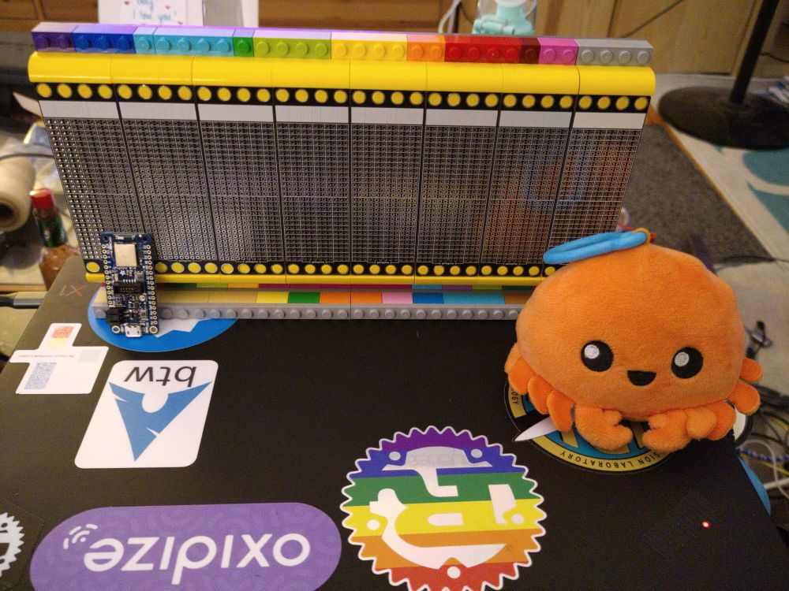

# Pellegrino

An aimless attempt at building a PC from scratch, in a vaguely eurorack/modular synth style.

## Software

The intended software for the Pellegrino PC is the MnemOS Operating system, a small general purpose operating system.

More information on MnemOS is located in [the firmware folder](./firmware/README.md).

## Context

Tweets:

* https://twitter.com/bitshiftmask/status/1507319968106520578
* https://twitter.com/bitshiftmask/status/1509266484324929544

## Photos

### An empty Pellegrino Rack

An empty rack of Wrap Proto boards, with the Adafruit nRF52840 Express that acts as the main CPU module for the PC.

### Wrap Proto

A no-decisions-made protoboard intended for wire wrap assembly of boards.
