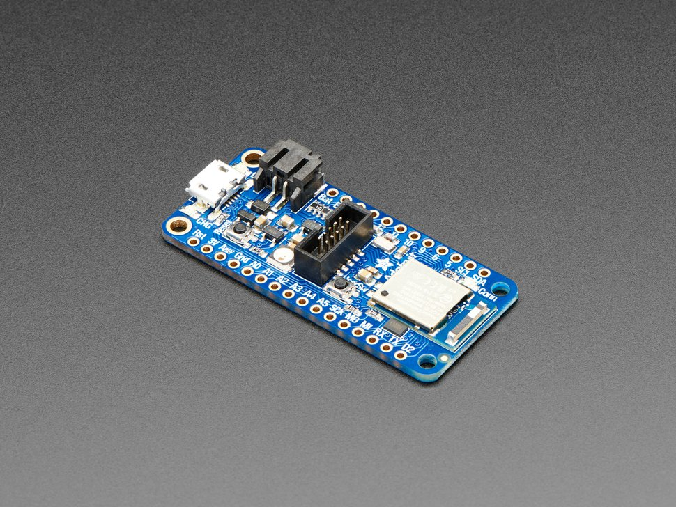
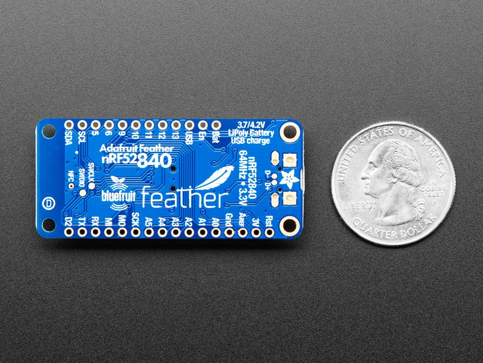

# Supported (and Required) Hardware

At the moment, two pieces of hardware are required for MnemOS development:

* A Main CPU
* An SWD debugger

Optionally, you may want additional "accessory cards". At the moment however, there are no accessory cards (we're still in early days!).

## Main CPU

At the moment, the only supported CPU is the Nordic nRF52840, specifically on the [Adafruit nRF52840 Feather Express](https://www.adafruit.com/product/4062) development board.

Support for other main CPUs is possible, but not currently supported (again, early days!).

This board has a number of important features, including:

* The nRF52840 Microcontroller
* A Micro USB connector, used for power and as a USB-Serial port
* A 2MiB QSPI Serial Flash chip, used as a Block Storage device for storing data and programs
* A WS2812B RGB LED (also known as a "NeoPixel" or "Smartled") for notifications

The board has many other features, but they are not currently used.

This board can be purchased directly from Adafruit, or from a number of resellers.

## An SWD Debugger

In order to program, debug, or update the kernel, a Cortex-M SWD adapter is necessary. This SWD adapter must be supported by the [probe-run](https://github.com/knurling-rs/probe-run) tool.

Common adapters include:

* SWD/JTAG debuggers from JLink
* DAPLink adapters
* Official and unofficial STLink adapters

Chances are, if you have written an Embedded Rust program before, and uploaded it with `probe-run`, `cargo-embed`, or `probe-rs`, your adapter will work with the feather board.

You will also need to connect your debugger to the Main CPU board. The main CPU has two main ways to attach a debugger:

* Using the 2x5 pin, 1.27mm pitch Cortex-M Debugging connector located on the top of the board
    * This is a common/standard footprint used by JLink adapters, and many development boards, though may not be compatible with lower cost adapters that have 0.1" (or 2.54mm) pitch cables.
    * This may require you to purchase an adapter/special cable, but will not require soldering.
* Using the test pads located on the bottom of the board
    * Using these test pads requires soldering wires to these test ports
    * You will need to connect the SWDIO and SWCLK test pads, as well as a GND connection to your debugger. It is not necessary to connect the RESET pin.

The test pads can be seen on the picture below. They are on the two gold circles on the left side of the board, and are labeled "SWCLK" and "SWDIO".

