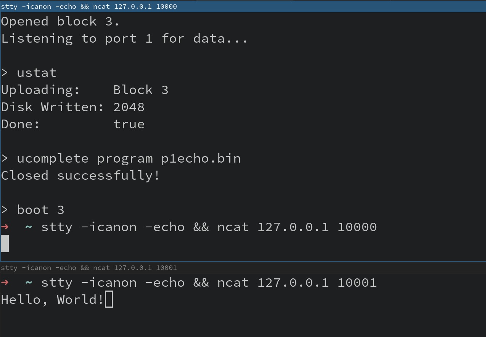

# Uploading and Running Programs

The following is a minimal guide to uploading and running programs on MnemOS.

This guide assumes you already have a binary built, or are using one of the 'official' binaries in the `firmware/kernel/appbins/` directory.

If you are building your own binary, see the [Building User Applications](./../dev-guide/build-apps.md) in the [Developers Guide](./../dev-guide/intro.md) chapter.

This guide also assumes you already have the `crowtty` tool running and connected. If you have not done that yet, see the [Connecting to Virtual Serial Ports](./serial.md) section.

## Enabling Upload Mode

The first step to uploading a program is to use the `app-loader` program to begin an upload.

Connect to Virtual Port 0, and select a block as the upload destination. If a block that already contains data is selected, the previous contents will be erased and replaced.

```sh
stty -icanon -echo && ncat 127.0.0.1 10000
> info
Block Storage Device Information:
blocks: 15, capacity: 65536

> block 3
03: name: None, kind: Unused, status: Idle, size: 0/65536

> upload 3
Opened block 3.
Listening to port 1 for data...

> ustat
Uploading:    Block 3
Disk Written: 0
Done:         false
```

## Uploading contents

Once the app-loader is waiting for an image, you will need to open a new terminal, and use the `dumbloader` tool.

The `dumbloader` tool takes three arguments:

1. The destination IP address (probably `127.0.0.1`)
2. The destination Port (probably `10001`)
3. The path to the firmware image to upload

```sh
cd tools/dumbloader
cargo run --release -- 127.0.0.1 10001 ../../firmware/kernel/appbins/p1echo.bin
    Finished release [optimized] target(s) in 0.02s
     Running `target/release/dumbloader 127.0.0.1 10001 ../../firmware/kernel/appbins/p1echo.bin`
Connected to '127.0.0.1:10001'.
Loaded file. 1936 bytes.
Sending 0x00000000
Sending 0x00000100
Sending 0x00000200
Sending 0x00000300
Sending 0x00000400
Sending 0x00000500
Sending 0x00000600
Sending 0x00000700
Done.
```

Once the `dumbloader` tool has completed the upload, you can return to the `app-loader` console (on virtual port 0).

Here, we check the upload state, and complete the upload. Completing the upload writes the program header, and closes the file
on the block device storage.

```sh
> ustat
Uploading:    Block 3
Disk Written: 2048
Done:         true

> ucomplete program p1echo.bin
Closed successfully!
```

## Running the program

You can then select your uploaded program to be run.

At the moment, this will cause the device to reset, which will close the `crowtty` tool, meaning you will need to close your `ncat` session and restart the `crowtty` tool before continuing.

```
> boot 3
(input/output stops...)
```

If you uploaded the `p1echo.bin` program, you should be able to open Virtual Port 0 and Virtual Port 1 in separate `ncat` sessions. Any characters typed into Port 0 will be printed out on Port 1.

It should look roughly like the following screenshot, with the top window being Port 0, which is selected and being typed into, and the bottom window being Port 1, showing the output:



> **NOTE**
>
> You do not need to re-upload your program on every boot, as the block storage that the programs are uploaded to
> is on non-volatile external flash storage.
>
> For now, you **will** always need to use the `app-loader` tool to run the `boot N` command to launch programs
