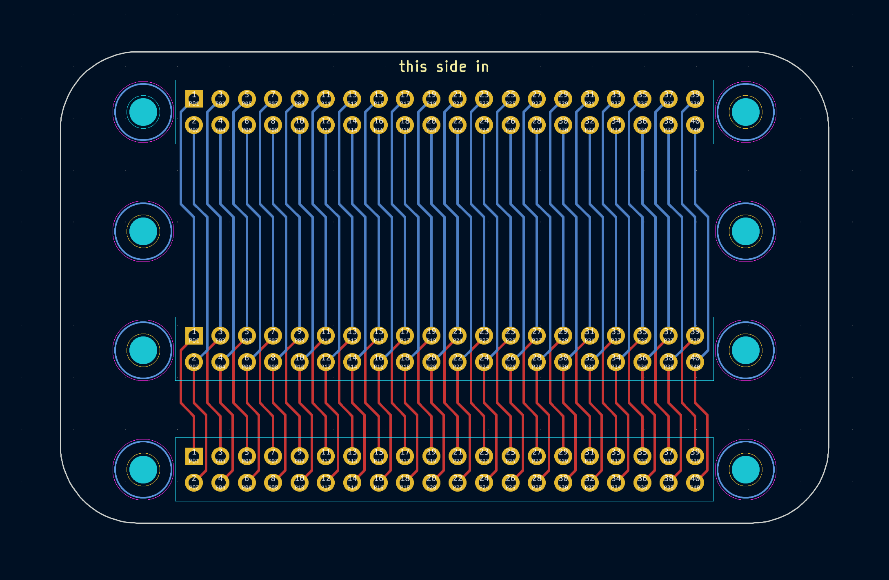

# Mnemos Shield

This is a basic breakout board for the beepy hardware, to overcome the fact that the MQ-Pro PTH are too small for the pogo pins used by the beepy board.

This board contains three 40-pin headers all connected in parallel with each other. All holes are 1.0mm inner diameter, which seems to work well on the pogo pins.

## Usage Warning

At the moment, it's not a *great* idea to power a beepy+MQ-Pro at the same time.

It's recommended (if you build one of these boards) to either:

* Don't connect the header pins for the MQ-Pro 5v0 rails
* Cut the traces on the shield

This will likely be fixed in a future revision. If you are planning to order boards from these design files, please drop by [#mnemos-dev:beeper.com](https://matrix.to/#/#mnemos-dev:beeper.com) so we can help you out!
