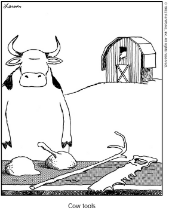

# MnemOS Development Tools

This directory contains tools to aid in MnemOS development. Unlike the sources
in the [`source/`] and [`platforms/`] directories, these tools are not part of
the MnemOS operating system. They are intended to run on a developer's machine
to assist in implementation and testing, rather than on a target platform as
part of the MnemOS environment.

## Folder Layout

* [`crowtty/`] - The CrowTTY virtual serial port multiplexor and trace viewer.
  CrowTTY multiplexes and de-multiplexes [`sermux`] frames sent and recieved
  over a UART connection from a target, and decodes
  [`mnemos-trace-proto`]-formatted diagnostic data.
* [`dumbloader/`] - An image loader type thing for Cortex-M, I think? We're not
  really using this thing anymore, and I'm not entirely sure what it does.
* [`f3repl/`] - A Forth repl for [`forth3`].
* [`manganese/`] - `mn`, the stupid mnemOS package manager. Manganese automates
  installing and running (some) of mnemOS' build-time dependencies.
* [`x86_64-bootimager/`] - A thingy for building (and running) bootable mnemOS
  disk image for x86_64 systems.

[`source/`]: ../source/
[`platforms/`]: ../platforms/
[`crowtty/`]: ./crowtty/
[`dumbloader/`]: ./dumbloader/
[`f3repl/`]: ./f3repl/
[`manganese/`]: ./manganese/
[`x86_64-bootimager/`]: ./x86_64-bootimager/

[`sermux`]: https://mnemos.dev/doc/sermux_proto/
[`mnemos-trace-proto`]: https://mnemos.dev/doc/mnemos_trace_proto/
[`forth3`]: https://mnemos.dev/doc/forth3/

## License

[MIT] + [Apache 2.0].

[MIT]: https://github.com/tosc-rs/mnemos/blob/main/LICENSE-MIT
[Apache 2.0]:https://github.com/tosc-rs/mnemos/blob/main/LICENSE-APACHE
